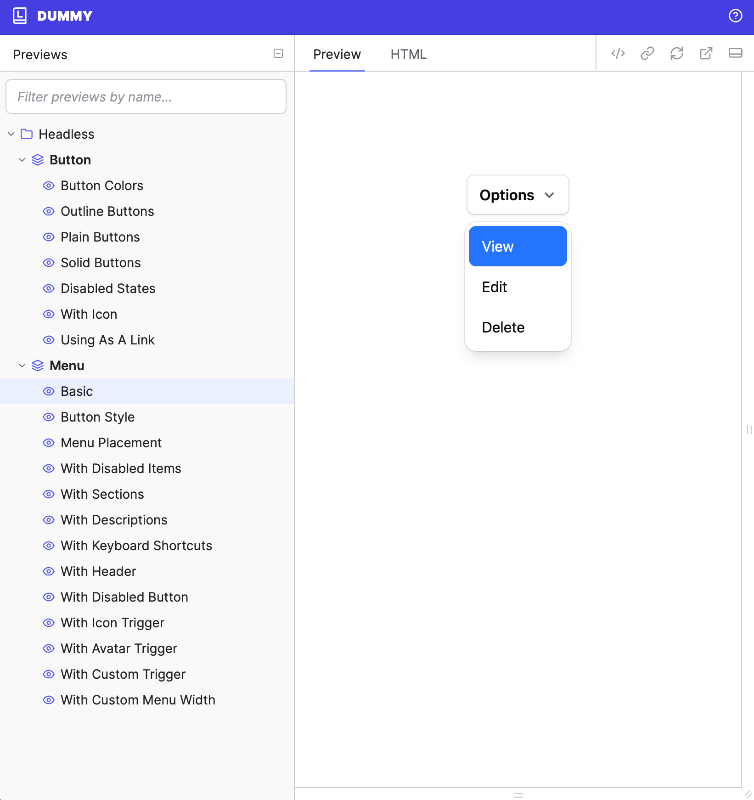

# Headless Components Rails

>[!WARNING]
>This gem is early stages and currently a proof of concept.

Headless Components Rails brings the power of [Headless UI](https://headlessui.com) to Rails developers by providing a set of unstyled, fully accessible UI components built with ViewComponent and Stimulus.

It aims to offer a seamless way to integrate the highly-regarded Headless UI patterns into your Rails applications, allowing you to build complex interfaces with maximum flexibility in styling.

This gem translates the original React components from Headless UI into a Ruby and Stimulus combination, making them idiomatic for the Rails ecosystem.

Currently, the primary focus has been on implementing the **Dropdown Menu** component. I haven't spent time developing base styling for those without Tailwind Plus, but I included preliminary basic ones. This initial implementation served as a proving ground for handling complex UI interactions, including:
*   Integration with libraries like Floating UI for positioning.
*   A custom Stimulus-based portaling mechanism (see `app/javascript/controllers/headless/portal_controller.js`) to manage elements rendered outside the main component DOM structure, mimicking concepts like React Portals without leaving Stimulus.

## Menu Component Example
```erb
  <%= render Headless::MenuComponent.new do |menu| %>
    <% menu.with_button do |button| %>
      Options
      <% button.with_icon(icon: "chevron-down") %>
    <% end %>

    <% menu.with_items do |items| %>
      <% items.with_item do %>
        View
      <% end %>
      <% items.with_item do %>
        Edit
      <% end %>
      <% items.with_item(disabled: true) do %>
        Delete
      <% end %>
    <% end %>
  <% end %>
```



## Catalyst Integration

Headless Components Rails also supports integrating styles from [Tailwind Catalyst](https://catalyst.tailwindui.com/). If you provide a local copy of the Catalyst source code, the gem can scrape the necessary styles to apply the official Tailwind UI look and feel to the components.

In order to do so, download Catalyst, then run
```bash
bin/rails headless:generate_utility_classes catalyst_path=path_to_catalyst_project
```
The path defaults to assuming it's in your root directory.

This will generate a Classy::Yaml file at `config/headless.yml` that will automatically be included for referencing in your app.

## Portals
In React, portals allow an HTML node to exist in the DOM separate from the parent, but maintain hierarchy as a child from within the shadow DOM. This can be extremely helpful with certain components, such as dropdowns and dialog/modal components so that they can escape from the inherited styles of the parent tree.

This project creates similar functionality with a fairly complicated `portal_controller`. When the portal controller is connected as an outlet and "synced", it manages some fancy proxy-ing and magic so that the original controller can find targets and receive actions in a remote node as if it is its own child. This drastically helps simplify components like `dropdown` where we want to allow the floating menu to be optionally portaled. 


## API
The aim is to follow the original Headless UI API as closely as possible. It will name the options and components 1:1 so that the documentation can serve relevant for both (with some minor adjustments for obvious ViewComponent syntax)


## Technical Highlights

*   **Tailwind CSS Integration**: Leverages the [`Classy::Yaml`](https://github.com/Tonksthebear/classy-yaml) gem to define component styles in a central location. This allows the [`tailwindcss-rails`](https://github.com/rails/tailwindcss-rails) gem to be configured to detect and include the necessary Tailwind classes in your build.
*   **Node-Free JSX Parsing**: Utilizes custom `{component_name}_parser.js` sidecar files alongside [`mini_racer`](https://github.com/rubyjs/mini_racer) and Babel. Each component can have its own parser (e.g., `menu_component/menu_component.parser.js`) nested within its directory structure. This enables parsing of JSX-like definitions within the gem for component structure and logic, *without requiring Node.js* to be installed in your development or production environment, and keeps parsing logic manageable and component-specific.
*   **Importmaps Ready**: Designed to work seamlessly with Rails applications using Importmaps for JavaScript management.
*   **Complex Interaction Proof**: The Dropdown component implementation successfully demonstrates handling intricate UI patterns like Floating UI integration and custom Stimulus-based portaling (inspired by React Portals, implemented in `portal_controller.js`).

## Installation

As this is currently a proof of concept, install it directly from GitHub. **It also assume your project has importmaps, stimulus, ViewComponent, and tailwind installed. It is not validating for this yet, so please be sure you have them installed.** Add this line to your application's Gemfile:

```ruby
gem "headless", git: "https://github.com/Tonksthebear/headless-components-rails.git"
```

And then execute:
```bash
bin/rails headless:install 
```

This will install a default `config/headless.yml` with basic styles that Headless UI provides. Don't forget, this can be overridden with your premium Catalyst styles for Tailwind Plus customers.

For Tailwind v4 configuration
```css
@import "tailwindcss";

# Used for forcing certain animations into hidden state
@source inline("!hidden");

# May need to change the relative location of where config/headless.yml is relative to your stylesheet
@source "../../config/headless.yml";
```
Tailwind should now also search the yaml file being used for styling.

## Contributing
Contributions and support are highly encouraged. A component library is a massive undertaking. I've waited years for Tailwind Plus to provide better first party support for the vanilla rails stack, but eventually decided I'd try and kick it off myself. It took me a while to figure out how to navigate the license while still soliciting community support. I'm confident this is a valid path to make it work though.

Currently there are no tests, as the developer experience is very much in flux. The project does use `rails-omakase` for linting.

### Lookbook
This Gem uses [Lookbook](https://lookbook.build) to preview components. When running the dummy app, you can preview it at `localhost:3000/lookbook`

## License
The gem is available as open source under the terms of the [MIT License](https://opensource.org/licenses/MIT).
