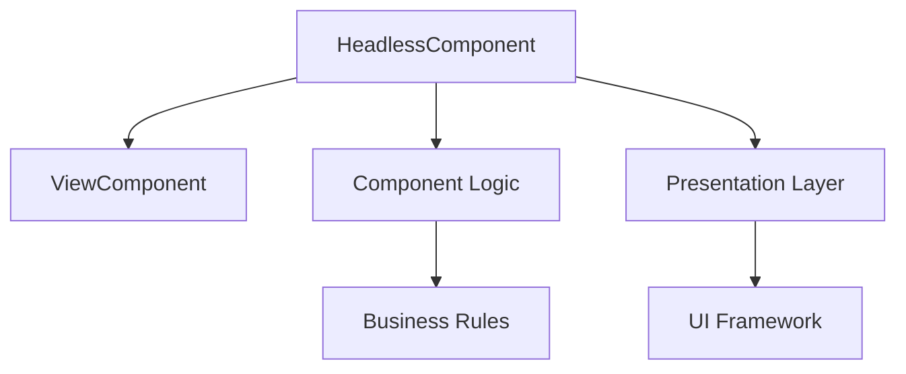

# System Patterns: Headless

## Architecture Overview
The gem follows a layered architecture pattern with clear separation between:
1. Core Component Layer
2. Integration Layer
3. Presentation Layer

## Key Technical Decisions
1. **Base Component Class**
   - Inherits from ViewComponent
   - Provides headless functionality
   - Handles core component lifecycle

2. **Integration with Rails**
   - Uses Rails ViewComponent system
   - Leverages Rails conventions
   - Maintains compatibility with Rails 8.0.2+

3. **Component Structure**
   - Logic separated from presentation
   - Clear interface definitions
   - Consistent API patterns

## Design Patterns in Use
1. **Headless Pattern**
   - Separation of concerns
   - Presentation agnostic
   - Logic isolation

2. **Component Pattern**
   - Encapsulated functionality
   - Reusable interface
   - Clear responsibilities

3. **Integration Pattern**
   - Rails conventions
   - ViewComponent compatibility
   - Extensible design

## Component Relationships


## Key Interfaces
1. **Component Interface**
   - `initialize`
   - `call`
   - `render?`

2. **Logic Interface**
   - State management
   - Event handling
   - Data processing

3. **Presentation Interface**
   - Template rendering
   - Style application
   - Layout management

## Extension Points
1. Custom component classes
2. Presentation layer implementations
3. Logic layer extensions
4. Integration adapters 

## ViewComponent Styling Pattern

### YAML Structure
Component styles are defined in a YAML file named after the component (e.g., `menu_component.yml`). The structure follows a hierarchical pattern:

```yaml
component_name:
  base: "base classes"
  child_component:
    base: "child classes"
    nested:
      value: "nested classes"
```

### Yass Helper Usage
The `yass` helper is used to access these styles in component templates. It uses nested hash syntax to navigate the YAML structure:

```erb
<%# Basic usage %>
<%= yass(component_name: :base) %>

<%# Accessing nested values %>
<%= yass(component_name: { child_component: { nested: :value } }) %>
```

Key points:
- Uses nested hash syntax to represent YAML hierarchy
- Nested components inherit from parent's YAML file
- The YAML structure directly maps to the nested hash structure used in `yass`

Example from MenuComponent:
```yaml
menu:
  button: "button classes"
  items:
    base: "items classes"
    transition:
      enter: "transition classes"
```

```erb
<%= yass(menu: :button) %>
<%= yass(menu: :items) %>
<%= yass(menu: { items: { transition: :enter } }) %>
``` 